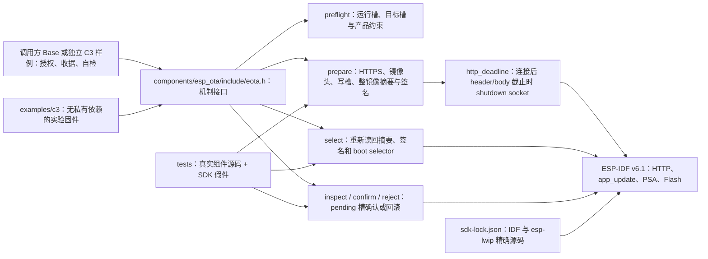

# ESP OTA

`esp-ota` 是独立的 ESP-IDF 签名应用升级组件。`components/esp_ota` 提供 `eota_` API，使用官方 `esp_http_client`、`app_update`、分区和 PSA SHA-256；应用继续负责授权、持久操作收据、业务静止、自检窗口和重启。当前处于开发阶段，host 故障测试与 C3 编译不代表实板升级已验收。

## 架构拓扑



准备阶段只写 inactive 应用槽并验证完整 signed bin，**不切启动槽**。应用可在两阶段之间持久提交与业务包的绑定；`eota_select` 再核对实际槽、摘要与 IDF 签名，并显式切槽。库不创建 worker、不写业务 NVS、不管理 Wasm 包，也不替应用决定何时确认新固件。具体调用合同见 [API 说明](docs/design/api-contract.md)。

## 独立构建

本仓不需要相邻 Base、FRP、MQTT、Container 或私有 Tool 才能运行 host 回归：

```bash
cmake -S . -B build -DBUILD_TESTING=ON
cmake --build build
ctest --test-dir build --output-on-failure
```

IDF 组件位于 `components/esp_ota`，`idf_component.yml` 固定 ESP-IDF 6.1.0；[SDK 锁](components/esp_ota/sdk-lock.json)还固定 IDF 完整提交和公开 `esp-lwip` 提交。构建守卫核对两份源码和 lwIP 以外的干净状态，防止用另一套 SDK 误报组合结果。已备好锁定 SDK 后：

```bash
python3 components/esp_ota/tools/check_sdk.py --path "$IDF_PATH"
idf.py -C examples/c3 build
```

[独立 C3 样例](examples/c3/README.md)默认不写 Flash 或 otadata；受控测试需要仓外输入、受控签名构建、已授权设备和恢复基线。编译、host 假件和临时测试键都不授权刷板、改分区、eFuse 或生产密钥操作。样例保持当前 4 MiB 双应用槽分区事实；新 Container 布局须另行验证后由调用方更新可信约束。

## 当前验证边界

- host ASan/UBSan 测试覆盖槽预检、准备与切槽分离、镜像头/长度/摘要/签名、HTTP 中断、SDK 错误、恢复读回及 pending 确认；socketpair 慢滴流测试验证连接后定时中断与清理同步。具体见[测试说明](tests/README.md)。
- ESP32-C3 普通构建与使用临时 RSA-3072 测试键的签名构建，只证明组件和样例在固定 SDK 下可编译，不含设备写入。
- SDK `esp_http_client_read` 和 header fetch 可在单次调用中处理多次底层读取；连接建立后，定时器到期会关闭该 socket 的收发，并在 SDK 返回后等待定时回调退出，再清理 HTTP 句柄。host 测试只证实本地 socket 慢滴流和假件调用层。DNS、首次连接、TLS 握手、请求发送以及证书主机名的真实 HTTPS 链路仍没有完整严格墙钟期限的证明；P5-04 与实板升级、回滚、Base 接入尚未验收。

源码与测试从 Base 已提交源码迁入的来源和改造边界见[来源记录](docs/design/source-provenance.md)。工作区完整阶段与验收条件以[五仓主计划](https://github.com/darren-you/darren-space/blob/master/harness/docs/design/darren-space/global/esp-base-frp-mqtt-ota-container-development-plan.md)为准。
本轮编译与 host 测试的精确结果见[开发检查点](docs/operations/development-checkpoint.md)。
