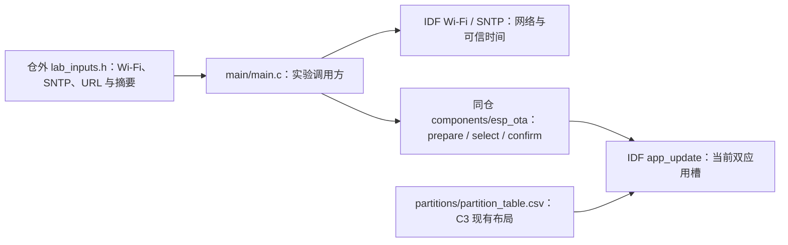

# 独立 C3 OTA 样例

此样例在 ESP-IDF v6.1、ESP32-C3、4 MiB Flash 上独立编译，引用同仓 `components/esp_ota`，不读取 Base、私有 Tool 或实际设备资料。默认配置启用 `CONFIG_ESP_HTTP_CLIENT_ENABLE_CUSTOM_TRANSPORT=y`，供签名 OTA 的全阶段网络期限使用。默认空输入和未武装模式只打印当前槽状态；不会写应用槽或 otadata。

## 架构拓扑



样例保留实验板当前 `ota_0=0x20000`、`ota_1=0x200000`、每槽 `0x1e0000` 的布局和 `base_store` 区，不执行分区迁移。`main.c` 的本地自检仅证明 NVS 可初始化和槽可检查；产品必须另行提供身份、配置与业务健康检查。样例没有产品操作收据，不能当作 Base 生产升级入口。

准备锁定 SDK 后进行**只编译**验证：

```bash
python3 ../../components/esp_ota/tools/check_sdk.py --path "$IDF_PATH"
idf.py -C . build
```

真实实验必须由维护者明确授权精确设备、分区及恢复基线，先建立受控签名运行/回退镜像。实验输入从仓外绝对路径传入 `-DEOTA_LAB_ARMED=ON -DEOTA_LAB_INPUTS=/absolute/path/lab_inputs.h`；格式见 `lab_inputs_example.h`。构建时复制到忽略的 build 目录，勿将凭据、签名私钥、真实设备身份或恢复件加入仓库。普通构建不具备签名升级能力，`eota_available` 将拒绝升级。

样例收到完整镜像后依次调用 `eota_preflight`、`eota_prepare`、`eota_select`，成功才重启；候选新启动只在本地检查和 30 秒稳定窗口后确认 pending。真实签名升级、断流、慢速滴流、回滚及恢复矩阵目前没有设备证据，按主计划继续未验收。人工断电测试暂缓。
