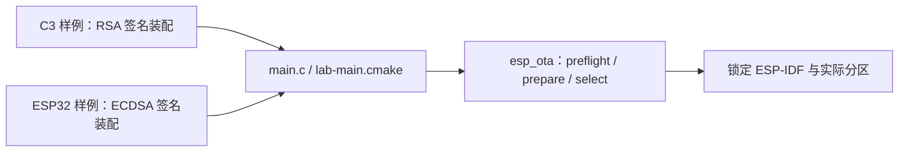

# 双目标共用 OTA 样例源码

`main.c` 和 `lab-main.cmake` 由 [C3 样例](../c3/README.md)与 [ESP32 样例](../esp32/README.md)分别装配。共用源码调用同一个 `eota_` 机制 API；各工程自行指定 target、分区事实、控制台与签名方案。本目录不单独构建，默认空实验输入不会执行网络升级。

## 架构拓扑

