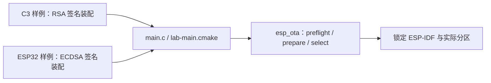

# 双目标共用 OTA 样例源码

`main.c` 和 `lab-main.cmake` 由 [C3 样例](../c3/README.md)与 [ESP32 样例](../esp32/README.md)分别装配。共用源码调用同一个 `eota_` 机制 API；各工程自行指定 target、分区事实、控制台与签名方案。本目录不单独构建，默认空实验输入不会执行网络升级。

武装样例在 Wi-Fi 初始化成功后、设置 STA 配置和启动前，显式选择 `WIFI_STORAGE_RAM`，实验 SSID 与密码不通过 Wi-Fi 驱动写入 NVS；该调用失败时 `connect_network()` 返回 `false`，调用方按原失败路径结束本次实验，不继续配置、连接或下载。NVS 初始化失败仍直接返回，不自动擦除。此设置只约束新配置的存储，不擦除既有 NVS 数据，也不代替实板联网、升级或恢复验收。

## 架构拓扑

```mermaid
flowchart LR
    c3["C3 样例：RSA 签名装配"] --> shared["main.c / lab-main.cmake"]
    esp32["ESP32 样例：ECDSA 签名装配"] --> shared
    shared --> library["esp_ota：preflight / prepare / select"]
    library --> idf["锁定 ESP-IDF 与实际分区"]
```
