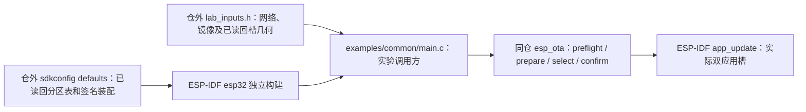

# 独立 ESP32 OTA 样例

此样例与 C3 样例共用 `examples/common/main.c`，以固定 ESP-IDF v6.1 的 `esp32` target 为 ESP32-D0WD-V3 编译。默认构建未武装，只读取运行槽；`sdkconfig.defaults` 选用官方通用双 OTA 表，**不代表当前实板分区**，不得把该构建或分区表写入设备。

## 架构拓扑



只读编译入口：

```bash
python3 ../../components/esp_ota/tools/check_sdk.py --path "$IDF_PATH"
idf.py -C . -B build-esp32 build
```

签名升级实验需先按五仓计划建立本板完整 Flash 恢复基线、当前分区/bootloader/运行槽和可回退签名镜像，取得精确设备授权。仓外 `lab_inputs.h` 除网络、时间、URL、完整 signed bin 长度及 SHA-256 外，必须填写从**本板**读回的 `EOTA_LAB_OTA_0_ADDRESS_BYTES`、`EOTA_LAB_OTA_1_ADDRESS_BYTES`、`EOTA_LAB_OTA_SIZE_BYTES`；格式见 [输入模板](lab_inputs_example.h)。仓外 sdkconfig defaults 必须启用 `CONFIG_PARTITION_TABLE_CUSTOM=y`，将 `CONFIG_PARTITION_TABLE_CUSTOM_FILENAME` 指向经核对的**本板**分区 CSV，并配置该 SDK 对 ESP32 target 选择的 ECDSA v1 签名与受控密钥。两份输入都须使用仓外、构建目录外的绝对路径；不同板卡与候选使用隔离的 build/sdkconfig 输出。武装构建会拒绝通用分区选择或缺失的槽几何：

```bash
idf.py -C . -B build-esp32-signed \
  -DEOTA_LAB_ARMED=ON \
  -DEOTA_LAB_INPUTS=/absolute/private/lab_inputs.h \
  -DEOTA_LAB_SDKCONFIG=/absolute/private/sdkconfig.defaults build
```

源码中的项目名为 `esp_ota_lab`，芯片 ID 从当前 target 的 `CONFIG_IDF_FIRMWARE_CHIP_ID` 取得（ESP32 为 `0x0000`）。组件仍在运行时核对实际分区地址、大小、状态、镜像头与 SDK ECDSA 验签；构建通过不代表当前设备满足这些条件。当前板的 `ota_0` 是旧 AT 固件、`ota_1` 为空，尚无与新测试键匹配的签名 bootloader 和可回退运行镜像；本次按读回分区做的离线签名构建不能直接刷入旧板。样例只做 NVS/槽本地自检，不提供 Base 的身份、配置、收据或业务健康判定。实板 HTTPS/Flash/确认/回滚与恢复矩阵仍按主计划 P5-05/P5-06 分别验收。
