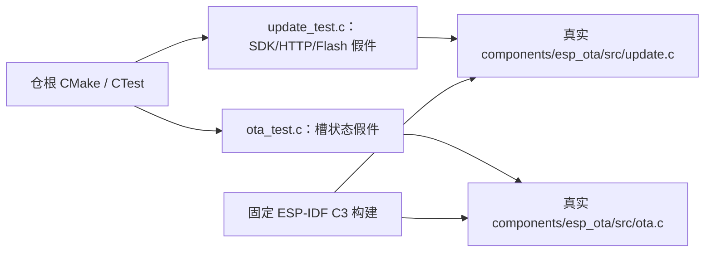

# 测试入口

## 架构拓扑

从仓根运行 `cmake -S . -B build -DBUILD_TESTING=ON && cmake --build build && ctest --test-dir build --output-on-failure`。AppleClang 可增加 `-DCMAKE_C_FLAGS='-fsanitize=address,undefined -fno-omit-frame-pointer'` 与相同 linker flags。假件只模拟调用层结果；真实 TLS、Flash、bootloader 和慢速滴流必须由独立网络/实板测试确认，当前未完成。
