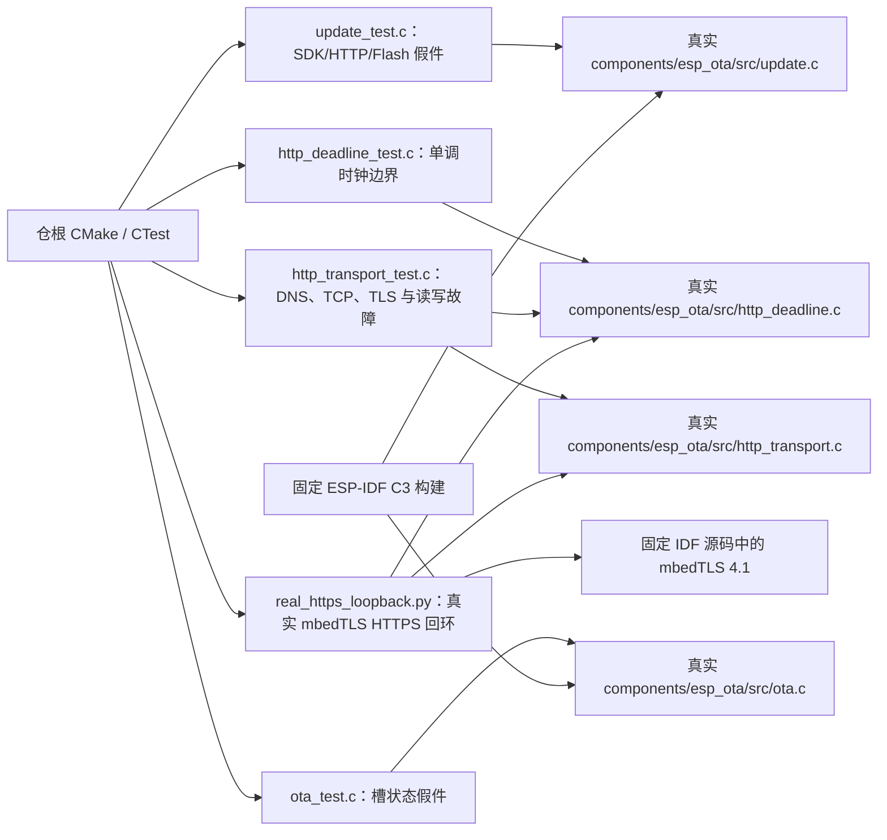

# 测试入口

## 架构拓扑

从仓根运行 `cmake -S . -B build -DBUILD_TESTING=ON && cmake --build build && ctest --test-dir build --output-on-failure`。AppleClang 可增加 `-DCMAKE_C_FLAGS='-fsanitize=address,undefined -fno-omit-frame-pointer'` 与相同 linker flags。`update_test` 用假件模拟 SDK 调用内的慢滴流与升级故障；`http_deadline_test` 用可控单调时钟验证迟到字节不得刷新旧无进展期限、持续进展不得延长总期限及时钟异常。`http_transport_test` 编译真实 transport 源码，配 DNS/TLS 假件与本地 TCP 服务复现 DNS 迟到回调、连接故障、握手延迟、请求写入和响应读取慢滴流。

`update_test` 的 selector 故障假件还按固定 IDF 语义把每次 `esp_ota_set_boot_partition` 的新 active 状态置为 NEW：验证目标已切换与 boot 仍指旧槽两种返回失败路径；恢复旧槽时重置为 VALID、清除未启动候选的 NEW 记录、预检可再次通过；恢复状态或清除记录失败则报告 boot 状态不确定。它还在槽预检、擦除、写入、HTTP 清理、分区读回和验签调用中推进假单调时钟，验证逾期后不再产出准备结果或执行切槽；槽预检耗尽总期限时不得创建网络客户端或写 Flash。`ota_test` 验证 UNTRACKED 状态不能冒充已确认的 pending 镜像。

同一 `update_test` 的镜像身份假件核对精确分区地址、SDK 验镜像先于整份 signed bin 摘要、末尾签名字节影响摘要、坏镜像／Flash 故障／错误几何拒绝及失败输出清零。假件不能证明真实 RSA 验签，签名 C3 构建只证明锁定 SDK 的 API 与配置可编译；真实可启动集合还要联合 otadata、boot selector、回退资格及设备读回。

传输回归还核对固定 ESP-IDF 的读取返回合同：单次 `read_timeout_ms` 到期返回可重试 timeout，TLS EOF 返回 FIN，致命 TLS 错误及总期限／无进展期限到期返回 failure。短读取超时后的下一次读取必须仍能收到数据；测试中的 TLS 假件要求跨多次底层收包才能拼出一条记录，验证持续慢滴流仍在单次读截止返回 timeout，下一次读可续完该记录。到达绝对期限后必须停止重试。

`EOTA_REAL_HTTPS_TEST=ON` 从锁定的 `IDF_PATH` 原生编译 mbedTLS 4.1，同一份 `http_transport.c` 对本地 Python TLS 服务读写。测试运行时生成临时 CA 和含 `localhost` SAN 的证书；TLS 1.2 用例断言正确信任链成功、错误 CA/主机名拒绝、SNI 原样发送、握手停顿截止及 HTTP 每 60 毫秒一字节时的总期限截止，另有 TLS 1.3 成功用例覆盖非致命 session ticket。该 host 适配只用假 DNS、FreeRTOS 信号量/transport 结构以及把临时 CA 注入 `esp_crt_bundle_attach` 的测试函数；证书解析、链校验、主机名检查和 TLS 握手/记录读写都由固定 SDK 的真实 mbedTLS 执行。原生库采用 host 默认配置，当前 C3 样例仅启用 TLS 1.2；此测试不运行 IDF 证书 bundle、`esp_http_client` 解析、目标芯片网络栈或 Flash/bootloader。P5-04 仍需实板链路验证。
