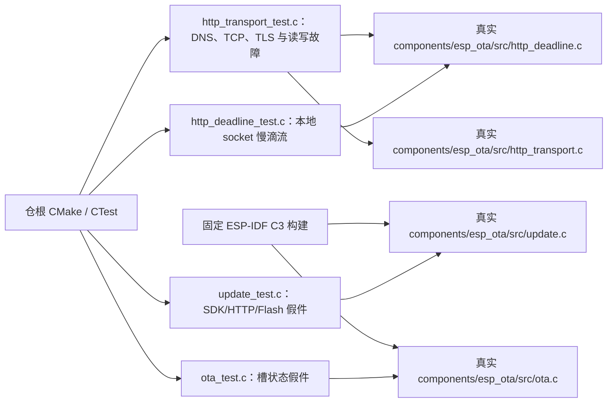

# 测试入口

## 架构拓扑

从仓根运行 `cmake -S . -B build -DBUILD_TESTING=ON && cmake --build build && ctest --test-dir build --output-on-failure`。AppleClang 可增加 `-DCMAKE_C_FLAGS='-fsanitize=address,undefined -fno-omit-frame-pointer'` 与相同 linker flags。`update_test` 用假件模拟 SDK 调用内的慢滴流与升级故障；`http_deadline_test` 以本地 socketpair 验证定时中断、晚发布 socket 和回调结束后的文件描述符复用。`http_transport_test` 编译真实 transport 源码，配 DNS/TLS 假件与本地 TCP 服务复现 DNS 迟到回调、连接故障、握手延迟、请求写入和响应读取慢滴流。假 TLS 可以核对配置调用和所有权，不能证明真实 CA/SNI/证书路径；完整 HTTPS、Flash 与 bootloader 仍需单独网络/实板证据。
