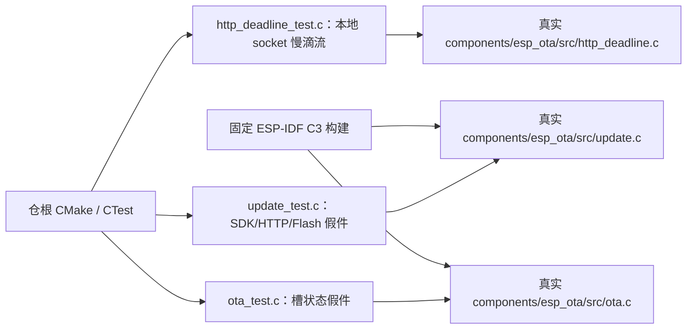

# 测试入口

## 架构拓扑

从仓根运行 `cmake -S . -B build -DBUILD_TESTING=ON && cmake --build build && ctest --test-dir build --output-on-failure`。AppleClang 可增加 `-DCMAKE_C_FLAGS='-fsanitize=address,undefined -fno-omit-frame-pointer'` 与相同 linker flags。`update_test` 用假件模拟一个 SDK header/body 调用内持续慢滴流；`http_deadline_test` 使用本地 socketpair 真实发送每 20 毫秒一字节，验证约 250 毫秒到期中断、定时回调完成后清理以及后续复用文件描述符不被旧定时器关闭。socketpair 不含 TLS；DNS、首次连接、真实 HTTPS 证书主机校验、Flash 与 bootloader 仍需单独网络/实板证据。
