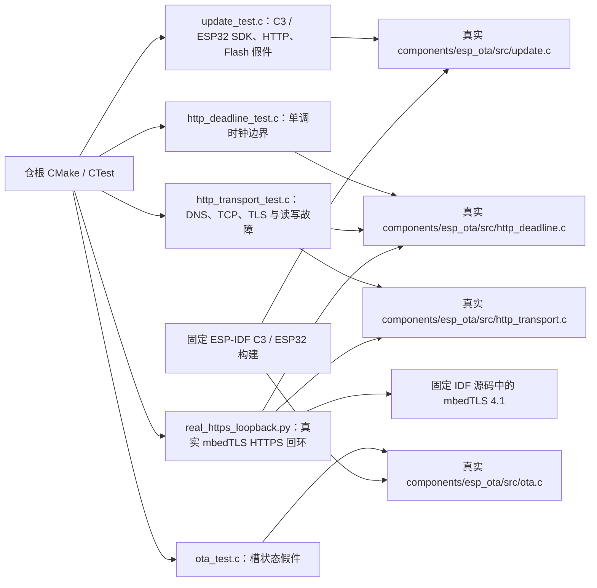

# 测试入口

## 架构拓扑

```mermaid
flowchart LR
    cmake["仓根 CMake / CTest"] --> update["update_test.c：C3 / ESP32 SDK、HTTP、Flash 假件"]
    cmake --> drip["http_deadline_test.c：单调时钟边界"]
    cmake --> transport["http_transport_test.c：DNS、TCP、TLS 与读写故障"]
    cmake --> https["real_https_loopback.py：真实 mbedTLS HTTPS 回环"]
    cmake --> confirm["ota_test.c：槽状态假件"]
    update --> real_update["真实 components/esp_ota/src/update.c"]
    drip --> deadline["真实 components/esp_ota/src/http_deadline.c"]
    transport --> real_transport["真实 components/esp_ota/src/http_transport.c"]
    transport --> deadline
    https --> real_transport
    https --> deadline
    https --> sdk["固定 IDF 源码中的 mbedTLS 4.1"]
    confirm --> real_ota["真实 components/esp_ota/src/ota.c"]
    idf["固定 ESP-IDF C3 / ESP32 构建"] --> real_update
    idf --> real_ota
```

从仓根运行 `cmake -S . -B build -DBUILD_TESTING=ON && cmake --build build && ctest --test-dir build --output-on-failure`。 CTest 的 `sdk_guard` 用本仓 Python reader 和真实临时 Git checkout 验证正式 SDK 派生清单、官方原文与实际源码、索引和子模块；独立准备正测只映射到本地 Git 来源，检查路径不下载或执行 SDK 脚本。未装配旧 SDK、清单漂移、链接、部分修改、额外修改及错误来源均须拒绝；这些夹具不授予真实 SDK 构建或设备资格。AppleClang 可增加 `-DCMAKE_C_FLAGS='-fsanitize=address,undefined -fno-omit-frame-pointer'` 与相同 linker flags。`update_test` 用假件模拟 SDK 调用内的慢滴流与升级故障；`http_deadline_test` 用可控单调时钟验证迟到字节不得刷新旧无进展期限、持续进展不得延长总期限及时钟异常。`http_transport_test` 编译真实 transport 源码，配 DNS/TLS 假件与本地 TCP 服务复现 DNS 迟到回调、连接故障和请求/响应读写。慢握手、慢写、持续读取与连续 TLS 票据通过假 TLS 单步推进单调时钟，核对精确期限和返回值；读取用例先把真实本地 socket 数据送达，再进入计时阶段，避免宿主线程调度耗尽测试预算。

`update_test` 与 `update_esp32` 分别用官方芯片 ID `0x0005` 和 `0x0000` 编译相同真实更新源码与完整故障矩阵，检查零值 ESP32 ID 可通过预检、无效哨兵 `0xffff` 被拒。selector 假件按固定 IDF 语义把每次 `esp_ota_set_boot_partition` 的新 active 状态置为 NEW：验证目标已切换与 boot 仍指旧槽两种返回失败路径；恢复旧槽时重置为 VALID、清除未启动候选的 NEW 记录、预检可再次通过；恢复状态或清除记录失败则报告 boot 状态不确定。另用同一份已准备镜像在选槽前切换项目名、芯片 ID 与 SDK 镜像头约束，要求不进入 boot selector。它还在槽预检、擦除、写入、HTTP 清理、分区读回和验签调用中推进假单调时钟，验证逾期后不再产出准备结果或执行切槽；槽预检耗尽总期限时不得创建网络客户端或写 Flash。`ota_test` 验证 UNTRACKED 状态不能冒充已确认的 pending 镜像。

`update_test` 还要求 `eota_prepare` 用 SDK 的 `OTA_WITH_SEQUENTIAL_WRITES` 启动 app 写入。固定 SDK 在该模式下由各次 `esp_ota_write` 按受影响扇区擦除；假件验证调用模式、准备／退役／切槽写调用及显式分区读取、槽状态观察、SDK 整镜像验证和回退资格查询均持有 Flash gate，网络进展回调不持有 gate，获取失败无写入及释放失败的未知结果。分区摘要按最多 1024 字节一段释放 gate 后再计算；假件不模拟 SDK 整镜像验签、实体 Flash 的单次耗时或与 FRP scratch 的真实争用。

静态镜像请求回归在同一 C3/ESP32 假件中验证：`eota_preflight` 可接受的 1 字节请求被公开校验入口拒绝，刚好容纳镜像头的长度获准；HTTPS URL 的协议、非空主机、方括号主机、可选端口、凭据、片段、空格与 512 字节边界按生产规则检查。`eota_prepare` 对相同坏请求在网络与擦写前拒绝。

准备收据回归先完成一次 `eota_prepare`，再用同一输出对象依次传入无可信时间、无效产品策略和空镜像请求；三个失败入口都必须清空旧收据，且不能重新触发 HTTP 初始化或 Flash 写入。这项测试直接编译 C3 与 ESP32 共用的真实 `update.c`，不证明设备端持久收据和跨启动对账。

旧备用槽退役回归在同一 C3/ESP32 假件中分别覆盖 OTA0→OTA1 与 OTA1→OTA0：运行槽必须 VALID、选中且完整验签摘要相符，错误目标、错误摘要或 pending 运行槽在擦除前拒绝。目标即使只是 app 侧验签失败但镜像魔数仍为 `0xe9`，也必须擦首扇区并读回 `0xff`；擦除失败、备用 otadata 失效失败保持不确定，原收据下再次进入只补未完成步骤，不重复擦已读回的空扇区。假件不能证明实体 Flash 的实际断电写入与 bootloader 回退行为。

同一 `update_test` 的镜像身份假件核对精确分区地址、SDK 验镜像先于整份 signed bin 摘要、末尾签名字节影响摘要、坏镜像／Flash 故障／错误几何拒绝及失败输出清零。C3 使用 RSA 配置宏，ESP32 使用 ECDSA v1 配置宏；假件不能证明真实签名验签，离线签名构建只证明锁定 SDK 的 API 与配置可编译；真实可启动集合还要联合 otadata、boot selector、回退资格及设备读回。

完整镜像长度回归要求准备、切槽和运行镜像收据查询都拒绝与 SDK 已验签 `image_len` 不一致的短请求或附加尾缀，覆盖签名失败、Flash／内存故障及额外验签返回时期限已尽。准备失败不得产出收据，选择失败不得写 boot selector；已经由 `esp_ota_end` 释放的句柄不能再 abort。该组测试曾在仅按请求长度摘要的旧实现上确定性失败。

传输回归还核对固定 ESP-IDF 的读取返回合同：单次 `read_timeout_ms` 到期返回可重试 timeout，TLS EOF 返回 FIN，致命 TLS 错误及总期限／无进展期限到期返回 failure。短读取超时后的下一次读取必须仍能收到数据；测试中的 TLS 假件要求跨多次底层收包才能拼出一条记录，验证持续慢滴流仍在单次读截止返回 timeout，下一次读可续完该记录。TLS 1.3 连续返回非致命会话票据时也必须按同一次读取期限返回 timeout，随后可重试接收应用数据。到达绝对期限后必须停止重试。

`EOTA_REAL_HTTPS_TEST=ON` 从锁定的 `IDF_PATH` 原生编译 mbedTLS 4.1，同一份 `http_transport.c` 对本地 Python TLS 服务读写。测试运行时生成临时 CA 和含 `localhost` SAN 的证书；TLS 1.2 用例断言正确信任链成功、错误 CA/主机名拒绝、SNI 原样发送、握手停顿截止及 HTTP 每 60 毫秒一字节时的总期限截止，另有 TLS 1.3 成功用例覆盖非致命 session ticket。HTTP 慢响应用例把 idle 期限设为不短于总期限，以便只验证总期限；较短 idle 期限由上述可控时钟的传输回归单独验证。该 host 适配只用假 DNS、FreeRTOS 信号量/transport 结构以及把临时 CA 注入 `esp_crt_bundle_attach` 的测试函数；证书解析、链校验、主机名检查和 TLS 握手/记录读写都由固定 SDK 的真实 mbedTLS 执行。原生库采用 host 默认配置，当前 C3 样例仅启用 TLS 1.2；此测试不运行 IDF 证书 bundle、`esp_http_client` 解析、目标芯片网络栈或 Flash/bootloader。P5-04 仍需实板链路验证。

共享工厂故障矩阵另外覆盖无可信时间、空或已过期期限、零连接预算、句柄／上下文分配与两个注册步骤失败后的释放；`http_no_time_date` 和 `http_no_certificate_bundle` 分别编译真实工厂并证明缺失必要 TLS 配置时拒绝创建。这些测试复用原 DNS／TCP／TLS 源码和私有进展函数，不开放新的网络刷新接口。

有界入站流回归在 `update`／`update_esp32` 两套真实源码中覆盖：完整精确输入与准备／选槽分离、缺 callback／短尺寸／超槽尺寸／无可信时间的提前拒绝，首字节／镜像头／正文／尾字节截断或断流，额外字节、数量越界、缺 EOF、错目标／摘要／签名和 SDK 完整镜像尺寸不符。可控时钟核对重试不刷新 idle、三个输入阶段各在 30 秒到期、持续数据不延长 300 秒总期限、剩余不足单次预算时传更短 timeout，以及 999,999 µs 的合法返回与 1,000,000 µs 的迟到字节拒绝。Flash 获取／释放、begin／write／读回失败和慢 Flash 返回均不得留下可选收据，输入／进度期间没有 claim；HTTP 初始化计数保持零。测试使用原有 SDK／PSA 假件，不能替代 FRP 真实认证／framing／并发预算、实体签名与掉电验收。
